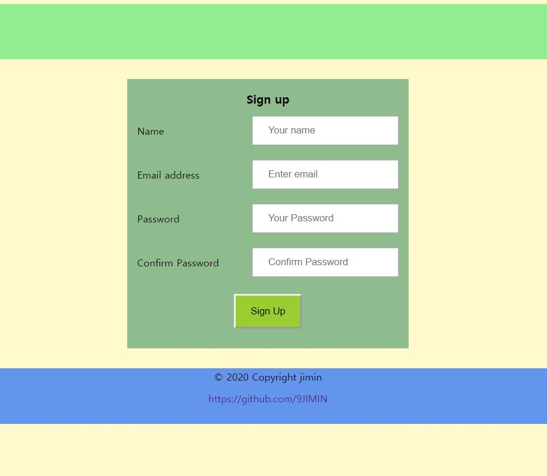

# tour-with

This is my first full stack website project. about tour product selling website. after [Natours of udemy lecture](https://www.udemy.com/course/nodejs-express-mongodb-bootcamp/), I want to make my own version of node based website. so this is what i make.

## Development process

It took about 3 weeks. (04/14~05/02)

- 04/14~04/18
- - user functionality
- - signup (password handling)
- - login
- - reset- password(when password forgot-> email sending)
    learn about authorization and handling user data, like password. and jwt to give token. and got to know about crypto functionality to hash password store in DB. its so fun to learn about user data in backend.
- 04/18~04/23
- - tour create page(new)
- - review tour
- - booking model
    learn how to reference other collection of DB, and populate. and in this period app getting bigger so have time to reconfiguration and even think about "what app i actually want to make?". and test deploy to cloud service. using heroku is not fit to this app. because of photo uploading functionality. so I use cloud linux server.
- 04/24~04/25
- - photo upload
- - booking- stripe
    uploading photo of user profile and tour images. uploading to local computer.(after this would be cloud server) when getting images, resize it to save storage. and delete old one when user update new photo.
    and i use stripe api to buy or selling tour product. for https testing i use ngrok package and after getting webhook of success, create booking document. like review model this also have user and tour id. in this period i have to think again about each DB collections relationship. they are all connected so how to populate and referencing is really important.
- 04/26~04/29
- - add CSS
- - review remake
    at first i'm gotta use bootstrap to make it fast. but i want to make this app 100% mine. so i write css code my own. but my css skill is suck. and design is not important things in this app. so i make it simple.
    and then, reviews. i make review model last few days. but the problem is it's only for tour. but i want to sign review to guide too. so rebuild the review, user model. and also make the it expose to account and tour page.
- 04/30~05/02
- - paginate
- - search and sort
- - error handling
- - map
- - deploy
    core functionality is almost done. but i still want to add something more. so paginate and search, sort to make the site more realistic. by doing this i can learn many things about url query and params to send data to backend.
    and also error handling to make user know what is wrong.
    my final challenge is to add map so guide can search place when he create tour. so i did it.
    after all implement, deploy it to naver cloud platform. using cloud server is quiet hard to understand. so i just follow the tutorial of some others work.
    but a anyway I did all the things. from a to z. so proud of myself.

## Website introduction

1. overview ( / )

header- logo and logout, account when user logged in. else login, signup.
tours- each tour card have cover image and some information. and search, sort, paginate functionality.
guide stats- top rating guides. if click go to guide's account.
2. user account ( /:user )

user profile- image, information, reviews i get.
tours- tours i made. can edit.
bookings- tours i buy after tour, can leave review. before tour can cancel. after leaving review it deleting.
3. signup ( /join)

4. login ( /login )

5. forgot password ( /reset_password )

search user with that email and send the reset link.
6. reset password ( /reset_password/:token )

7. tour ( /:user/:tour )

tour images and information. reviews and guide. most important, map that can show days plan and locations. you can see popup when click the markers.
8. user update ( /settings)

user data and password update.
9. tour update ( /:user/:tour/edit)

10. tour create ( /new)

when you click the map new input field is create so guide can type the each locations information.
11. review ( /:user/:tour/review) 

after tour user can leave review to tour and guide. that rating and review goes to tour and guide rating and recalculate the average.

## What I learned

I started coding October last year, at first it's so fun to make web page with html, css and little javascript. but what i learned so far is all design. Not the actual working web service. so i decide to make real web site so that i can share all over the world. after searching good lecture to take. I choose Jonas's node.js course and learned how to make full stack application. at first it was difficult to accept the content about database, api routing.. with my short english skills. but i heard it over and over again. so it toke almost 2 months to finish to course and i have learned a lot.
after finished the course I decide to make this natours app again. but my style. At first it is fun to make my app not copying other ones code. but when app getting bigger there's ton's of errors occur. so past 3 weeks I spent most of my time fixing the error, crushed my head on to the keyboard, "why error!?!" that's 90% of last three weeks. I wanted to give up several times a day. i didn't give up. if i quit this time again, i really felt like i couldn't do anything. although it took a lot longer than I thought, I did it to the end. Of course it's not perfect, and there's a lot of errors, but I implement every functionality I dreamed of.
I learned a lot about coding through this project, but the most big thing i got is 'attitude that goes to the end.'
